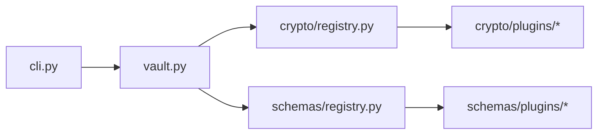

# credmgr

A local-first CLI password manager with pluggable cryptography and
pluggable content — no cloud sync, server, or telemetry.

[](LICENSE)


`credmgr` stores your credentials in one or more envelope-encrypted vault
files on your own machine. Unlock a vault with a master password;
everything else operates on decrypted data only in memory, for the
duration of a command or a short cached session.

```bash
credmgr init
credmgr add netflix alice --generate
credmgr get netflix alice
credmgr audit
```

## Why credmgr

- **Local-first.** Everything lives under `~/.credmgr/`. Nothing is ever
  sent anywhere except the one-time, optional download of public
  password-strength datasets.
- **Pluggable encryption.** The core never imports a crypto library
  directly — it talks to an abstract backend interface. Install only the
  dependency your chosen algorithm needs, and switch algorithms later
  with `credmgr migrate`, with no downtime and no plaintext touching disk.
- **Pluggable content.** Vaults aren't limited to one shape. The bundled
  `credentials` schema stores service/account logins with history;
  the `env` schema stores flat `KEY=VALUE` secrets. Multiple named
  vaults, each with its own schema and backend, can coexist.
- **No black boxes.** Wrong password and tampered file are handled by
  the same AEAD authentication check and produce the same clear error —
  never corrupted data returned silently.

## Key features

| Area | Capability |
|---|---|
| **Storage** | One or more versioned, envelope-encrypted vault files, each self-contained under `~/.credmgr/vaults/<name>/` |
| **Encryption** | Pluggable backends — AES-256-GCM (`cryptography` or `pycryptodome`) and XChaCha20-Poly1305 (`PyNaCl`); keys derived via Argon2id |
| **Content schemas** | Pluggable vault content — `credentials` (services/accounts/passwords/history) or `env` (flat `KEY=VALUE` entries) |
| **Multi-vault** | Create, list, switch between, and delete independently encrypted vaults |
| **Search** | Exact, substring, and fuzzy matching |
| **Generation** | Cryptographically secure random passwords or Diceware-style passphrases |
| **Clipboard** | Copy with automatic timed clearing |
| **Audit** | Detects weak, duplicate, reused, stale, and breached passwords (`credentials` schema) |
| **Session cache** | Optional short-lived, RAM-backed key cache to avoid re-typing the master password |
| **Backend & password rotation** | `credmgr migrate` re-encrypts under a new backend; `credmgr passwd` rotates the master password — neither ever writes plaintext to disk |

See the full [command reference](docs/cli-reference.md) for everything
`credmgr` can do.

## Installation

**Install as a package:**

```bash
git clone https://github.com/Veerabadran-M/credential-manager.git
cd credential-manager
pip install .
```

**Or run without installing:**

```bash
pip install -r requirements.txt
python credmgr.py <command>        # or: python -m credmgr <command>
```

**Pick at least one crypto backend:**

```bash
pip install credmgr[pynacl]           # XChaCha20-Poly1305 (recommended default)
pip install credmgr[pycryptodome]     # AES-256-GCM via pycryptodome
pip install credmgr[cryptography]     # AES-256-GCM via cryptography
pip install credmgr[all]              # every bundled backend
```

`credmgr`'s core has no crypto dependency at all — commands that need one
only ever offer installed backends, and requesting an uninstalled one
produces an actionable `pip install credmgr[...]` message.

> **Termux (Android):** `PyNaCl` doesn't ship a prebuilt wheel for Termux,
> so pip tries to build `libsodium` from source, which fails on many
> devices. Install the system `libsodium` package and point the build at
> it instead:
>
> ```bash
> pkg install libsodium clang pkg-config
> export SODIUM_INSTALL=system
> pip install "credmgr[pynacl] @ git+https://github.com/Veerabadran-M/credential-manager.git"
> ```
>
> `SODIUM_INSTALL=system` must be set *before* installing `PyNaCl`
> (directly or as a `credmgr` extra) on Termux.

## Quick start

```bash
credmgr init                          # choose backend, Argon2 params, set master password
credmgr add netflix alice             # add a credential
credmgr add netflix alice --generate  # ...or with a generated password
credmgr get netflix alice             # retrieve it
credmgr copy netflix alice            # copy the password to clipboard instead
credmgr search netflix                # search across everything
credmgr audit                         # check password health
```

`init` also offers to download optional datasets (word list,
common-passwords list, breach-hash database) used to improve password
generation and the audit command. Requires internet; skip with
`--skip-data-fetch` or run later with `credmgr fetch-data`. `credmgr`
stays fully functional offline either way, falling back to small
built-in defaults.

## Basic examples

**Rotate your master password** (instant regardless of vault size — only
the wrapped key is re-encrypted):

```bash
credmgr passwd
```

**Switch crypto backends** without ever writing plaintext to disk:

```bash
credmgr migrate --backend aesgcm-cryptography
```

**Run multiple vaults with different content**, e.g. personal logins
alongside a flat secrets store:

```bash
credmgr vault create work --schema credentials
credmgr vault create employee --schema env
credmgr vault use employee
credmgr add EMPLOYEE_ID 123456
credmgr vault list
```

**Change how a password is generated:**

```bash
credmgr config set password_length 24
credmgr generate --passphrase --words 6
```

For the full command list, flags, and matching behavior, see the
[CLI reference](docs/cli-reference.md).

## Architecture summary

`credmgr` is organized around two independent plugin systems layered
over a small, versioned vault file:

- **`credmgr/crypto/`** — an abstract `EncryptionBackend` interface,
  discovered and looked up through a registry, so the application core
  never imports a crypto library directly.
- **`credmgr/schemas/`** — an abstract `Schema` interface that owns the
  *shape* of a vault's contents (`credentials`, `env`, or a custom
  schema you add), so `vault.py` and `cli.py` stay generic.
- **`credmgr/vault.py`** — versioned, envelope-encrypted file I/O that
  depends on both interfaces by name, never by import.



This is only a summary — full diagrams and module-by-module detail live
in [docs/architecture.md](docs/architecture.md).

## Documentation

| Document | Covers |
|---|---|
| [docs/architecture.md](docs/architecture.md) | Package layout, module responsibilities, data flow, package/plugin diagrams |
| [docs/vault-format.md](docs/vault-format.md) | On-disk `vault.json` structure, multi-vault directory layout, vault lifecycle |
| [docs/crypto.md](docs/crypto.md) | Envelope encryption, Argon2id parameters, backend selection, encryption flow diagrams |
| [docs/plugin-system.md](docs/plugin-system.md) | Crypto and schema plugin interfaces, discovery mechanism, how to write a new plugin |
| [docs/cli-reference.md](docs/cli-reference.md) | Full command reference, flags, and examples |
| [docs/development.md](docs/development.md) | Dev environment setup, running tests, code style, extension points |
| [docs/migration.md](docs/migration.md) | Vault-version, legacy-layout, and crypto-backend migrations |

Also see [SECURITY.md](SECURITY.md) for the threat model and
vulnerability disclosure process.

## Limitations & threat model (short version)

Single-user, single-machine, no sync or sharing, no 2FA/MFA storage, no
backdoor or password recovery by design, POSIX-only. Full detail in
[SECURITY.md](SECURITY.md).

## Contributing

Contributions are welcome — see [docs/development.md](docs/development.md)
for development setup, running tests, and the pull request process. Good
first areas: a new crypto backend or schema plugin (see
[docs/plugin-system.md](docs/plugin-system.md)), documentation, and test
coverage.

## License

[MIT](LICENSE) © Veerabadran M

## Disclaimer

Provided as-is. Follows established cryptographic best practices
(Argon2id, AEAD ciphers) but has not undergone a formal third-party
security audit. Use at your own discretion, and keep independent backups
of your vault files.

## A note on AI assistance

The original codebase was written by the creator. From there, ongoing
documentation and maintenance of this project are done with the help
of AI.
