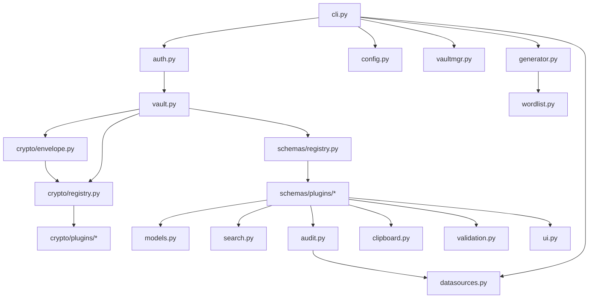

# Architecture

This document explains how `credmgr` is put together: the package layout,
each module's responsibility, and how data flows from a typed command to
an encrypted file on disk and back.

For the on-disk file format itself, see [vault-format.md](vault-format.md).
For encryption details, see [crypto.md](crypto.md). For the plugin systems,
see [plugin-system.md](plugin-system.md).

## Design goals

1. **Local-first.** No server, sync, or telemetry. Everything lives in
   `~/.credmgr/`.
2. **Pluggable cryptography.** The application core never imports a crypto
   library directly — it depends on an abstract `EncryptionBackend`
   interface and asks a registry for whichever plugin a vault says it uses.
3. **Pluggable content.** What a vault *stores* (service credentials, flat
   key/value pairs, or something else entirely) is decided by a `Schema`
   plugin, not hard-coded into the vault or CLI layers.
4. **Fail safe, not silent.** Tampering, wrong passwords, and missing
   dependencies all raise distinct, typed errors instead of returning
   corrupted data or crashing with a raw traceback.

## Package layout

```
credential-manager/
├── credmgr.py                # Standalone entry point (run without installing)
├── pyproject.toml            # Packaging metadata, dependencies, console-script entry point
├── requirements.txt          # Plain pip requirements
├── tests/                    # pytest suite
└── src/
    └── credmgr/
        ├── __init__.py           # Package docstring / version
        ├── __main__.py           # `python -m credmgr` entry point
        ├── cli.py                # Typer-based argument parsing and generic command dispatch
        ├── config.py              # Runtime configuration (defaults + persisted overrides)
        ├── vault.py                # Versioned, encrypted vault file I/O + format migrations
        ├── vaultmgr.py              # Multi-vault directory management
        ├── auth.py                  # Master-password auth + session DEK caching
        ├── models.py                 # Account / Credentials / PasswordHistoryEntry data models
        ├── generator.py               # Password / passphrase generation
        ├── wordlist.py                 # Bundled fallback word list
        ├── datasources.py               # Downloads optional security datasets
        ├── search.py                     # Fuzzy + global search (credentials schema)
        ├── audit.py                       # Password health audit (credentials schema)
        ├── clipboard.py                    # Clipboard copy with auto-clear
        ├── ui.py                            # Terminal rendering helpers (rich)
        ├── validation.py                     # Shared text-input validation
        ├── crypto/                            # Pluggable AEAD encryption backend system
        │   ├── base.py                          # EncryptionBackend interface
        │   ├── registry.py                       # Plugin discovery, lookup, selection
        │   ├── exceptions.py                      # CryptoError and subclasses
        │   ├── envelope.py                         # KDF + DEK wrap/unwrap primitives
        │   ├── ciphers.py                           # Legacy, unused pre-plugin cipher module (see note below)
        │   └── plugins/                              # One file per crypto backend
        │       ├── aesgcm_cryptography.py
        │       ├── aesgcm_pycryptodome.py
        │       └── xchacha_pynacl.py
        └── schemas/                            # Pluggable vault-content schema system
            ├── base.py                           # Schema interface
            ├── registry.py                        # Plugin discovery, lookup
            └── plugins/                             # One file per schema
                ├── credentials.py                     # Service / account / password / history
                └── env.py                               # Flat KEY=VALUE entries
```

> **Note on `crypto/ciphers.py`:** this module predates the plugin
> architecture and is not imported by any current code path — the active
> encryption backends live in `crypto/plugins/`. It's kept in the tree only
> because the short cipher names it defines (`aes256gcm`,
> `xchacha20poly1305`) are the same names referenced when upgrading
> pre-plugin (schema version 1) vaults; see [migration.md](migration.md).

## Module responsibilities

| Module | Responsibility |
|---|---|
| `cli.py` | Parses arguments with Typer and dispatches generic commands (`add`, `get`, `search`, …) to the active vault's schema. Contains no schema-specific logic. |
| `config.py` | Defines the `Configuration` dataclass, its defaults, validation rules, and persistence to `~/.credmgr/config.json`. |
| `vault.py` | Owns the on-disk vault file: create, unlock, save, master-password rotation, and backend migration. Delegates content shape to the active schema and encryption to the active crypto backend — it knows the names of neither. |
| `vaultmgr.py` | Manages the *filesystem layout* of named vaults (`~/.credmgr/vaults/<name>/`): create, list, delete, and the one-time migration of a pre-multi-vault install into that layout. |
| `auth.py` | Prompts for the master password, unlocks the vault, and manages the short-lived, RAM-backed session cache of the DEK. |
| `models.py` | Plain dataclasses (`Account`, `Credentials`, `PasswordHistoryEntry`) that make up the `credentials` schema's in-memory document. |
| `generator.py` | Cryptographically secure random password and Diceware-style passphrase generation. |
| `search.py` | Exact → substring → fuzzy matching across services, userids, and notes, for the `credentials` schema. |
| `audit.py` | Detects weak, duplicate, reused, stale, and breached passwords, for the `credentials` schema. |
| `clipboard.py` | Copies a value to the clipboard and clears it after a timeout, in a forked background process. |
| `ui.py` | Terminal rendering (tables, prompts, colored output) built on `rich`. |
| `validation.py` | Shared single-line/multiline text validation used by schema plugins. |
| `crypto/` | The pluggable AEAD encryption backend system — see [crypto.md](crypto.md). |
| `schemas/` | The pluggable vault-content schema system — see [plugin-system.md](plugin-system.md). |

## Data flow

A mutating command (e.g. `credmgr add netflix alice --generate`) flows
through the layers like this:

```mermaid
flowchart LR
    A[User types command] --> B["cli.py<br/>(Typer parses args)"]
    B --> C["auth.py<br/>authenticate()"]
    C --> D["vault.py<br/>Vault.unlock() / unlock_with_dek()"]
    D --> E["crypto registry<br/>get_backend(name)"]
    E --> F["crypto plugin<br/>decrypt()"]
    F --> G["schemas registry<br/>get_schema(name)"]
    G --> H["schema plugin<br/>parse() → in-memory document"]
    H --> I["schema plugin<br/>cmd_add() mutates document"]
    I --> J["vault.py<br/>Vault.save()"]
    J --> K["schema plugin<br/>serialize() → bytes"]
    K --> L["crypto plugin<br/>encrypt()"]
    L --> M["Atomic write to vault.json"]
```



Read-only commands (`get`, `list`, `search`, …) stop after step H/I —
nothing is re-serialized or re-written unless the schema's `cmd_*` method
returns `True`, signaling a mutation (see `cli.py`'s `_save_if_mutated`).

## Package relationships



Arrows point from "depends on" to "depended upon." Note that neither
`vault.py` nor `cli.py` ever points at a specific crypto library or a
specific schema plugin — both are reached only through their registries.
This is what makes new backends and schemas purely additive (see
[plugin-system.md](plugin-system.md)).

## Encryption workflow (summary)

`credmgr` uses **envelope encryption**: a master password derives a
Key-Encryption Key (KEK) via Argon2id, which wraps a random Data-Encryption
Key (DEK); the DEK in turn encrypts the actual vault contents. This is
what lets `credmgr passwd` (master password rotation) be instant regardless
of vault size — only the small, fixed-size DEK is re-wrapped.

Full detail, parameters, and diagrams live in [crypto.md](crypto.md).

## Plugin loading

Both the crypto backend system and the schema system use the same
discovery pattern: `pkgutil.iter_modules()` walks a `plugins/` package,
imports each module, and registers any subclass of the relevant interface
(`EncryptionBackend` or `Schema`) it finds. A plugin whose import fails —
missing dependency, syntax error, anything — is skipped, never crashes
the app.

Full detail lives in [plugin-system.md](plugin-system.md).

## Schema system

Every vault stores a plaintext `schema` field alongside its encrypted
contents (see [vault-format.md](vault-format.md)), naming which `Schema`
plugin owns the shape of that vault's data. `vault.py` never has an
opinion about that shape — it hands decrypted bytes to
`schemas.get_schema(name).parse(...)` and gets back an opaque in-memory
"document" object, which `cli.py` in turn hands to that same schema's
`cmd_*` methods for every CRUD operation. Two schemas ship today:

| Schema | Document shape | Typical use |
|---|---|---|
| `credentials` (default) | Nested `service → [account, ...]` tree with password history | Service/website login credentials |
| `env` | Flat, ordered `KEY=VALUE` list | Lightweight secrets or config store |

See [plugin-system.md](plugin-system.md) for the full interface and how to
add a new one.
