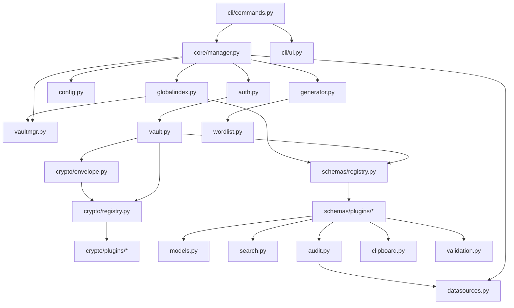
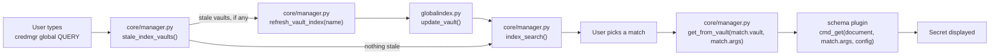

# Architecture

This document explains how `credmgr` is put together: the package layout,
each module's responsibility, and how data flows from a typed command to
an encrypted file on disk and back.

For the on-disk file format itself, see [vault-format.md](vault-format.md).
For encryption details, see [crypto.md](crypto.md). For the plugin systems,
see [plugin-system.md](plugin-system.md).

## Design goals

1. **Local-first.** No server, sync, or telemetry. Everything lives in
   `~/.credmgr/`.
2. **Pluggable cryptography.** The application core never imports a crypto
   library directly — it depends on an abstract `EncryptionBackend`
   interface and asks a registry for whichever plugin a vault says it uses.
3. **Pluggable content.** What a vault *stores* (service credentials, flat
   key/value pairs, or something else entirely) is decided by a `Schema`
   plugin, not hard-coded into the vault, application, or CLI layers.
4. **Frontend/core separation.** All application logic — vault
   management, authentication, CRUD dispatch, the search index — lives in
   an application layer (`credmgr/core/`) with a plain Python API that
   never touches a terminal. The bundled Typer CLI (`credmgr/cli/`) is
   just one caller of that API; a REPL, TUI, GUI, or REST frontend could
   be added later without duplicating or reaching into any of this logic.
5. **Fail safe, not silent.** Tampering, wrong passwords, and missing
   dependencies all raise distinct, typed errors instead of returning
   corrupted data or crashing with a raw traceback.

## Package layout

```
credential-manager/
├── credmgr.py                # Standalone entry point (run without installing)
├── pyproject.toml            # Packaging metadata, dependencies, console-script entry point
├── requirements.txt          # Plain pip requirements
├── tests/                    # pytest suite
└── src/
    └── credmgr/
        ├── __init__.py           # Package docstring / version
        ├── __main__.py           # `python -m credmgr` entry point
        ├── config.py              # Runtime configuration (defaults + persisted overrides)
        ├── vault.py                # Vault Format v1 file I/O (envelope encryption + backend migration)
        ├── vaultmgr.py              # Multi-vault directory management
        ├── auth.py                  # Master-password unlock + session DEK caching (no prompting)
        ├── models.py                 # Account / Credentials / PasswordHistoryEntry data models
        ├── generator.py               # Password / passphrase generation
        ├── wordlist.py                 # Bundled fallback word list
        ├── datasources.py               # Downloads optional security datasets
        ├── search.py                     # Fuzzy + global search (credentials schema)
        ├── audit.py                       # Password health audit (credentials schema)
        ├── globalindex.py                  # Cross-vault metadata search index (`credmgr global`)
        ├── clipboard.py                    # Clipboard copy with auto-clear
        ├── validation.py                     # Shared text-input validation
        ├── core/                              # Application layer -- see "Frontend/core split" below
        │   ├── __init__.py                       # Re-exports CredentialManager + key exceptions
        │   └── manager.py                          # CredentialManager: the single entry point for frontends
        ├── cli/                                # Terminal frontend (Typer)
        │   ├── __init__.py                        # Re-exports `app` (Typer instance) and `main`
        │   ├── commands.py                          # Argument parsing, prompts, dispatch to CredentialManager
        │   └── ui.py                                 # Rich console helpers: rendering, prompts, getpass
        ├── crypto/                            # Pluggable AEAD encryption backend system
        │   ├── base.py                          # EncryptionBackend interface
        │   ├── registry.py                       # Plugin discovery, lookup, selection
        │   ├── exceptions.py                      # CryptoError and subclasses
        │   ├── envelope.py                         # KDF + DEK wrap/unwrap primitives
        │   └── plugins/                              # One file per crypto backend
        │       ├── aesgcm_cryptography.py
        │       ├── aesgcm_pycryptodome.py
        │       └── xchacha_pynacl.py
        └── schemas/                            # Pluggable vault-content schema system
            ├── base.py                           # Schema interface + CommandResult/Line/Table result types
            ├── registry.py                        # Plugin discovery, lookup
            └── plugins/                             # One file per schema
                ├── credentials.py                     # Service / account / password / history
                └── env.py                               # Flat KEY=VALUE entries

```

## Frontend/core split

`credmgr/core/manager.py` defines `CredentialManager`, a facade class
that is the *only* thing a frontend needs to import. Every operation the
tool supports — creating/using/deleting vaults, config, generating
secrets, and every CRUD command — is a method on it. Two rules keep it a
real application layer rather than "the same code with a different name":

* **No terminal I/O, anywhere below it.** `CredentialManager`,
  `credmgr/auth.py`, and the schema plugins it dispatches to never
  import Typer or Rich, and never call `print()`/`input()`/`getpass()`.
  They take plain arguments in and return plain data out — dataclasses,
  primitives, or a schema `CommandResult` (see below) — and raise typed
  exceptions (`VaultError`, `AuthenticationError`, `SchemaError`,
  `VaultManagerError`, `BackendUnavailableError`, ...) for anything that
  can't succeed.
* **Secrets are requested, not collected.** When an operation needs the
  vault's master password and no valid cached session key covers it,
  `CredentialManager.unlock()` (and everything built on it) raises
  `PasswordRequired` instead of prompting. When a write command like
  `add`/`update` needs a *new* secret value to store and wasn't told to
  generate one, the schema raises `SecretRequired`. Either way, the
  frontend catches the exception, obtains the value however fits it
  (a terminal prompt, for the CLI), and retries the same call with the
  value supplied. `credmgr/cli/commands.py`'s `_call()` helper is exactly
  this retry loop for the Typer frontend; a different frontend would
  write its own.

`credmgr/cli/` is that Typer frontend: `commands.py` parses arguments,
calls a `CredentialManager` method, and renders (or prompts for)
whatever comes back via `cli/ui.py`. It holds no application logic of
its own — everything it does is either argument parsing, terminal I/O,
or a direct call into CredentialManager.

### Schema command results

Schema `cmd_*` methods (see [plugin-system.md](plugin-system.md)) don't
print or read from the terminal either — they return a `CommandResult`
(defined in `schemas/base.py`):

| Field | Meaning |
|---|---|
| `lines` | User-facing messages, in order, each with an optional semantic Rich style string (`Line(text, style)`). |
| `table` | An optional `Table(headers, rows)` payload for commands that produce one (e.g. `get`). |
| `raw` | Optional plain, unstyled text for output meant to be piped/redirected (e.g. `export`). |
| `mutated` | `True` if the document changed and the caller must persist it. |
| `choices` | For commands that would otherwise interactively ask "which one did you mean?" (e.g. `copy` against a service with several accounts): the values a caller can retry the same command with. |
| `needs_confirmation` | `True` if a destructive write command (e.g. deleting every account under a service) stopped short of mutating and is waiting for the caller to retry with `confirmed=True`. |

`CredentialManager` dispatches CRUD operations to the active vault's
schema generically and persists the vault (and refreshes the search
index) whenever `result.mutated` is `True`; `credmgr/cli/ui.py`'s
`render_result()` turns `lines`/`table` into actual terminal output.
Nothing about this is schema-specific, which is what lets `cli/commands.py`
stay generic across schemas.

## Module responsibilities

| Module | Responsibility |
|---|---|
| `core/manager.py` | `CredentialManager`: the application layer's single entry point. Vault lifecycle, config, generation, and CRUD dispatch to the active schema — all as plain Python calls that return data or raise exceptions, never printing or prompting. |
| `cli/commands.py` | Parses arguments with Typer, calls `CredentialManager`, and renders the result. Contains no schema-specific logic and no application logic beyond argument parsing and terminal I/O. |
| `cli/ui.py` | Terminal rendering (tables, prompts, colored output) built on `rich`, plus `getpass`-based password prompts. |
| `config.py` | Defines the `Configuration` dataclass, its defaults, validation rules, and persistence to `~/.credmgr/config.json`. |
| `vault.py` | Owns the on-disk vault file: create, unlock, save, master-password rotation, and backend migration. Delegates content shape to the active schema and encryption to the active crypto backend — it knows the names of neither. |
| `vaultmgr.py` | Manages the *filesystem layout* of named vaults (`~/.credmgr/vaults/<name>/`): create, list, and delete. |
| `auth.py` | Unlocks a vault given an already-known master password, and manages the short-lived, RAM-backed session cache of the DEK. Never prompts — see "Frontend/core split" above. |
| `models.py` | Plain dataclasses (`Account`, `Credentials`, `PasswordHistoryEntry`) that make up the `credentials` schema's in-memory document. |
| `generator.py` | Cryptographically secure random password and Diceware-style passphrase generation. |
| `search.py` | Exact → substring → fuzzy matching across services, userids, and notes, for the `credentials` schema. |
| `audit.py` | Detects weak, duplicate, reused, stale, and breached passwords, for the `credentials` schema. |
| `globalindex.py` | Owns `~/.credmgr/index.json`, the metadata-only search catalogue behind `credmgr global`: derives entries from an already-decrypted document (via a schema's `index_entries`), tracks per-vault staleness from file metadata, and answers cross-vault searches. Doesn't decrypt anything itself, though a stale entry means the caller (`CredentialManager.refresh_vault_index()`) must unlock that one vault to bring it back in sync before searching. |
| `clipboard.py` | Copies a value to the clipboard and clears it after a timeout, in a forked background process. Returns a `ClipboardResult` instead of printing. |
| `validation.py` | Shared single-line/multiline text validation used by schema plugins. |
| `crypto/` | The pluggable AEAD encryption backend system — see [crypto.md](crypto.md). |
| `schemas/` | The pluggable vault-content schema system — see [plugin-system.md](plugin-system.md). |

## Data flow

A mutating command (e.g. `credmgr add netflix alice --generate`) flows
through the layers like this:

```mermaid
flowchart LR
    A[User types command] --> B["cli/commands.py<br/>(Typer parses args)"]
    B --> C["core/manager.py<br/>CredentialManager.add()"]
    C --> D["core/manager.py<br/>unlock() (cache, or via PasswordRequired)"]
    D --> E["vault.py<br/>Vault.unlock() / unlock_with_dek()"]
    E --> F["crypto registry<br/>get_backend(name)"]
    F --> G["crypto plugin<br/>decrypt()"]
    G --> H["schemas registry<br/>get_schema(name)"]
    H --> I["schema plugin<br/>parse() → in-memory document"]
    I --> J["schema plugin<br/>cmd_add() mutates document,<br/>returns CommandResult"]
    J --> K["core/manager.py<br/>persists if result.mutated"]
    K --> L["vault.py<br/>Vault.save()"]
    L --> M["schema plugin<br/>serialize() → bytes"]
    M --> N["crypto plugin<br/>encrypt()"]
    N --> O["Atomic write to vault.json"]
    J --> P["cli/ui.py<br/>render_result()"]
```



Read-only commands (`get`, `list`, `search`, …) stop after step J/P —
nothing is re-serialized or re-written unless the schema's `cmd_*` method
returns a `CommandResult` with `mutated=True` (see
`CredentialManager._save()`).

## Package relationships



Arrows point from "depends on" to "depended upon." Note that
`core/manager.py` is the *only* thing `cli/commands.py` depends on for
application logic, and neither it nor `vault.py` ever points at a
specific crypto library or a specific schema plugin — both are reached
only through their registries. This is what lets new backends and
schemas be added as new files rather than edits to existing ones (see
[plugin-system.md](plugin-system.md)), and
what makes a second frontend (REPL, TUI, GUI, REST API, ...) possible
without touching anything below `credmgr/cli/`.

## Cross-vault search (`global`) data flow

`credmgr global <query>` never decrypts every vault to search it — it
searches `globalindex.py`'s on-disk catalogue of metadata, which every
mutating command keeps current as a side effect of the flow above (once
`vault.save()` succeeds, `CredentialManager._save()` hands the same
in-memory document to `globalindex.update_vault()` — no extra unlock, no
extra vault read):



Only the vault behind the final selection (step G) is ever unlocked to
retrieve a secret; any unlocks in step C are solely to bring a stale
vault's metadata back in sync, and happen before the user has even seen
a list of matches. The active vault named in `config.active_vault` is
never read from or written to by any of this.

## Encryption workflow (summary)

`credmgr` uses **envelope encryption**: a master password derives a
Key-Encryption Key (KEK) via Argon2id, which wraps a random Data-Encryption
Key (DEK); the DEK in turn encrypts the actual vault contents. This is
what lets `credmgr passwd` (master password rotation) be instant regardless
of vault size — only the small, fixed-size DEK is re-wrapped.

Full detail, parameters, and diagrams live in [crypto.md](crypto.md).

## Plugin loading

Both the crypto backend system and the schema system use the same
discovery pattern: `pkgutil.iter_modules()` walks a `plugins/` package,
imports each module, and registers any subclass of the relevant interface
(`EncryptionBackend` or `Schema`) it finds. A plugin whose import fails —
missing dependency, syntax error, anything — is skipped, never crashes
the app.

Full detail lives in [plugin-system.md](plugin-system.md).

## Schema system

Every vault stores a plaintext `schema` field alongside its encrypted
contents (see [vault-format.md](vault-format.md)), naming which `Schema`
plugin owns the shape of that vault's data. `vault.py` never has an
opinion about that shape — it hands decrypted bytes to
`schemas.get_schema(name).parse(...)` and gets back an opaque in-memory
"document" object, which `core/manager.py` in turn hands to that same
schema's `cmd_*` methods for every CRUD operation. Two schemas ship today:

| Schema | Document shape | Typical use |
|---|---|---|
| `credentials` (default) | Nested `service → [account, ...]` tree with password history | Service/website login credentials |
| `env` | Flat, ordered `KEY=VALUE` list | Lightweight secrets or config store |

See [plugin-system.md](plugin-system.md) for the full interface and how to
add a new one.
