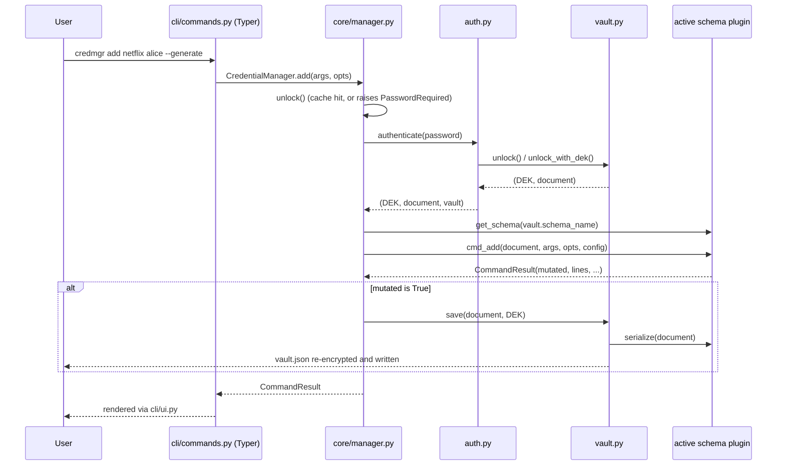

# CLI Reference

`credmgr` is built with [Typer](https://typer.tiangolo.com/). Run
`credmgr --help` or `credmgr <command> --help` at any time for full,
up-to-date usage — this page is a organized companion, not a replacement.

## Request flow

Every command follows the same generic dispatch path through
`cli/commands.py` and `core/manager.py`, regardless of which schema the
active vault uses:



Setup commands (`init`, `passwd`, `migrate`, `config`, `vault ...`) skip
the schema-dispatch step and operate on the vault or config directly, via
their own `CredentialManager` methods.

## Setup & configuration

| Command | Description |
|---|---|
| `credmgr init [--skip-data-fetch] [--backend NAME]` | Initialize the active vault (defaults to a `default` vault with the `credentials` schema) |
| `credmgr fetch-data` | (Re-)download the wordlist / common-passwords / sequences / breach-hash datasets |
| `credmgr passwd` | Change the master password (re-wraps the DEK only; vault contents untouched) |
| `credmgr migrate [--backend NAME]` | Re-encrypt the active vault under a different crypto backend |
| `credmgr config show` | Display current configuration |
| `credmgr config set <key> <value>` | Change a mutable configuration value |
| `credmgr config reset` | Reset configuration to defaults (with confirmation) |

## Vault management

| Command | Description |
|---|---|
| `credmgr vault create <name> [--schema NAME] [--backend NAME]` | Create a new named vault |
| `credmgr vault list` | List all vaults and their schema; `*` marks the active one |
| `credmgr vault current` | Show the active vault's name |
| `credmgr vault use <name>` | Switch the active vault |
| `credmgr vault delete <name>` | Delete a vault (must not be the active one; asks for confirmation) |

## Entry read/write commands (schema-dispatched)

These commands are generic — their exact argument shape depends on the
active vault's schema. Examples below assume the default `credentials`
schema (`<service> [userid]`); for the `env` schema, substitute
`<KEY> [VALUE]`; for the `text` schema, substitute `[line|start-end]`
(or no args at all — see below). See [plugin-system.md](plugin-system.md)
for schema details.

| Command | Description |
|---|---|
| `credmgr list` | List all stored entries in the *active* vault |
| `credmgr list-all` | List every service and userid under it *(credentials schema)*, or every key *(env schema)* — across **every vault on disk**, not just the active one. Prompts for each vault's master password in turn (`*` marks the active vault, same as `vault list`). Not supported by the `text` schema |
| `credmgr get <service> [userid]` | Display credentials in a table |
| `credmgr search <query>` | Fuzzy search across entries |
| `credmgr copy <service> [userid]` | Copy a value to the clipboard (auto-clears) |
| `credmgr add <service> <userid> [--generate] [--passphrase] [--notes "..."]` | Add an entry |
| `credmgr update <service> <userid> userid <new_userid>` | Rename an account's userid *(credentials schema)* |
| `credmgr update <service> <userid> password [--generate] [--passphrase]` | Change password, old one kept in history *(credentials schema)* |
| `credmgr update <service> <userid> notes "<text>"` | Update notes *(credentials schema)* |
| `credmgr update <service> <userid> account <new_userid> [--generate] [--passphrase]` | Replace both userid and password in one step, old password kept in history *(credentials schema)* |
| `credmgr update <KEY> <VALUE>` | Update a value *(env schema)* |
| `credmgr history <service> <userid>` | Show password history for an account *(credentials schema only)* |
| `credmgr delete <service> [userid]` | Delete an account, or a whole service if no userid given |
| `credmgr audit` | Run the password health audit *(credentials schema only)* |
| `credmgr export` | Print the entire vault as plaintext (always re-prompts for the password) |
| `credmgr import <filepath>` | Import entries from a file, skipping duplicates/invalid entries |
| `credmgr generate [--passphrase] [--length N] [--words N]` | Generate a password/passphrase without storing it |

### The `text` schema

A `text` vault has no keyed entries at all — the decrypted plaintext
*is* the document, so the generic commands above are repurposed around
line numbers purely for convenience:

| Command | Description |
|---|---|
| `credmgr get` | Print the whole vault content |
| `credmgr get <line>` / `credmgr get <start>-<end>` | Print one line or an inclusive range of lines (1-indexed) |
| `credmgr search <text>` | Print every line containing `text` (case-insensitive), with line numbers |
| `credmgr copy` | Copy the entire content to the clipboard |
| `credmgr copy <line>` | Copy just that line |
| `credmgr add <text...>` | Append `text...` as one new line |
| `credmgr add <filepath>` | Upload/append the content of an existing file, verbatim (like `import`) |
| `credmgr add` | Open `config.editor` on a blank temp file; whatever's saved is appended verbatim |
| `credmgr update <text...>` | Replace the entire content with `text...` (pass `""` to clear it without a confirmation prompt) |
| `credmgr update <filepath>` | Replace the entire content with an existing file's content, verbatim |
| `credmgr update` | Open `config.editor` on a temp file pre-filled with the current content, so you edit it in place; whatever's saved replaces the vault |
| `credmgr delete` | Clear the entire content (asks for confirmation first) |
| `credmgr delete <line>` | Remove just that line, no confirmation needed |
| `credmgr import <filepath>` | Append the file's content to whatever is already stored |
| `credmgr export` | Print the raw content exactly as stored |

`add`/`update <filepath>` only kick in when the single argument names a
file that actually exists on disk (`os.path.isfile`) — anything else,
including a nonexistent path, is treated as literal text instead. The
editor used for the no-argument form is `config.editor`, which
defaults to `$VISUAL`, then `$EDITOR`, then a platform default
(`nano`, or `notepad` on Windows); override it with `credmgr config set
editor <command>` (e.g. `vim`, `"code --wait"`).

`list-all`, `history`, and `audit` aren't supported by `text`, and its
vaults don't participate in `credmgr global` — there are no
identifiers to index, only the content itself.

Service/userid lookups (`get`, `copy`, `update`, `delete`, `history`) use
progressively looser matching in the `credentials` schema: exact →
case-insensitive substring → fuzzy (`difflib`, threshold configurable via
`fuzzy_threshold`). Ambiguous matches list candidates instead of guessing.

`list-all` is the one exception to "operates on the active vault only":
it walks every vault returned by `credmgr vault list`, unlocking each in
turn (its own master password, its own schema) before printing that
vault's listing.

## Cross-vault search (`global`)

| Command | Description |
|---|---|
| `credmgr global <query>` | Search a metadata index across **every vault** for `query`, without switching or decrypting the active vault. Once you pick a result, it prompts for that one vault's password and displays the entry. |

```bash
credmgr global github
credmgr global OPENAI_API_KEY
```

Unlike every other entry command, `global` never touches the active
vault. It searches `~/.credmgr/index.json` — a plaintext catalogue of
searchable identifiers only (service names, userids, env keys — never
passwords or keys) that every mutating command (`add`/`update`/`delete`/
`import`/`vault create`/`vault delete`) keeps in sync automatically. If
a vault's contents changed without the index knowing (a fresh install,
a hand-edited `vault.json`, ...), `global` detects that from file
metadata alone and transparently re-indexes just that vault (prompting
for its password) before searching — no vault is ever decrypted just to
search it.

- **No matches** → `No matching entries found.`
- **One match** → shows vault/schema/summary and asks `View this secret? [Y/n]`.
- **Multiple matches** → a numbered list (`vault  schema  <schema-specific summary>`) to pick from.

Whichever way you get there, only the one vault behind your final
selection is ever unlocked — see [plugin-system.md](plugin-system.md)
for how a schema plugin contributes to and resolves entries in the
index.

## Common flags

| Flag | Applies to | Meaning |
|---|---|---|
| `--generate` | `add`, `update`, `generate` | Generate a value instead of prompting |
| `--passphrase` | `add`, `update`, `generate` | Generate a Diceware-style passphrase instead of a random password |
| `--length N` | `add`, `update`, `generate` | Generated password length |
| `--words N` | `add`, `update`, `generate` | Generated passphrase word count |
| `--notes "..."` / `-n` | `add` | Attach notes to a new entry |
| `--backend NAME` | `init`, `vault create`, `migrate` | Choose a crypto backend non-interactively |
| `--schema NAME` | `vault create` | Choose a schema for a new vault (default: `credentials`; also `env`, `text`) |
| `--skip-data-fetch` | `init` | Skip downloading optional security datasets |

## Examples

```bash
# First-time setup
credmgr init

# Everyday credentials use
credmgr add netflix alice --generate
credmgr get netflix alice
credmgr copy netflix alice
credmgr search netflix
credmgr audit

# Multiple vaults with different schemas
credmgr vault create work --schema credentials
credmgr vault create employee --schema env
credmgr vault use employee
credmgr add EMPLOYEE_ID 123456
credmgr vault use default

# A vault that's just an encrypted text file
credmgr vault create notes --schema text
credmgr vault use notes
credmgr add "server root password is in the safe"
credmgr add ./private-key.pem       # uploads the file's content
credmgr config set editor vim       # or "code --wait", etc. (default: $VISUAL/$EDITOR)
credmgr add                         # opens $EDITOR on a blank file
credmgr update                      # opens $EDITOR pre-filled with the current content
credmgr get
credmgr vault use default

# Maintenance
credmgr passwd
credmgr migrate --backend aesgcm-cryptography
credmgr config set password_max_age_days 60

# Find something without knowing (or switching to) its vault
credmgr global github
credmgr global OPENAI_API_KEY
```
