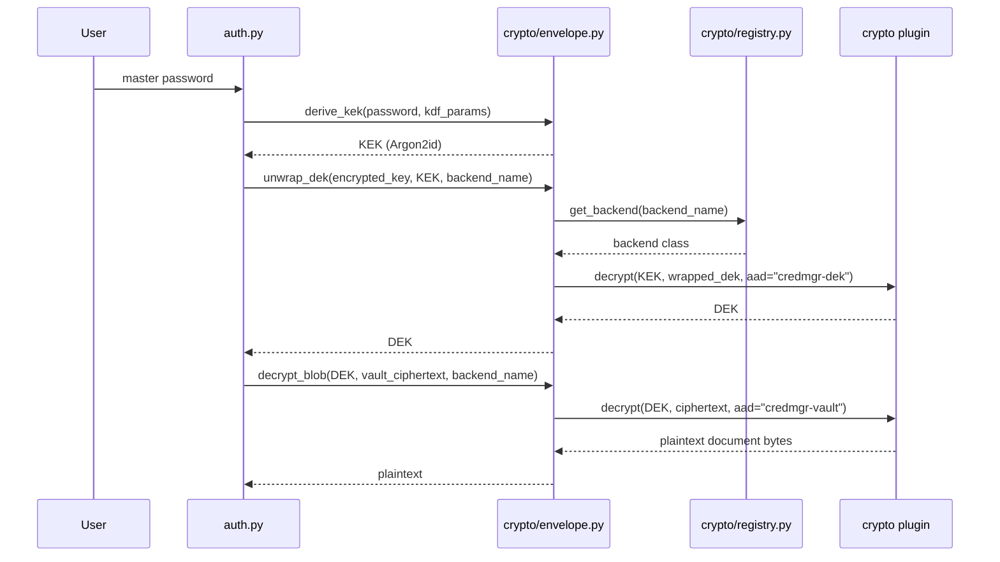

# Cryptography

`credmgr` uses **envelope encryption** to keep the master password
separate from the key that actually protects your data. This document
covers the key derivation, the AEAD backends available, and how
encryption flows during common operations.

For how backends are discovered and how to write a new one, see
[plugin-system.md](plugin-system.md). For where these values are stored
on disk, see [vault-format.md](vault-format.md).

## Overview

```
Master Password ──Argon2id──► Key-Encryption Key (KEK)
DEK (random 256-bit) ──AEAD encrypt, AAD="credmgr-dek"──► encrypted_key   [key: KEK]
Vault document (schema-serialized bytes) ──AEAD encrypt, AAD="credmgr-vault"──► vault ciphertext   [key: DEK]
```

1. **Key derivation (KEK).** The master password plus a random 16-byte
   salt go through **Argon2id** (OWASP's recommended password-hashing
   KDF), producing a 256-bit KEK. It's deliberately slow and
   memory-hard, to make offline brute-force expensive.
2. **DEK generation.** A random 256-bit **Data-Encryption Key** is
   generated once, at vault creation. This is what actually encrypts
   the vault contents.
3. **Key wrapping.** The DEK is AEAD-encrypted under the KEK and stored
   as `encrypted_key`.
4. **Data encryption.** The schema's serialized document is AEAD-encrypted
   **as one blob** under the DEK, stored as `vault`.
5. **Unlocking.** Re-derive the KEK, unwrap the DEK, decrypt the vault
   blob. Tampering or a wrong password fails AEAD authentication —
   `credmgr` reports `"Authentication failed."` rather than returning
   corrupted plaintext.

**Why envelope encryption:** changing the master password
(`credmgr passwd`) only re-derives the KEK and re-wraps the small,
fixed-size DEK. Vault contents are never re-encrypted, so rotation is
instant regardless of vault size.

## Encryption flow



## AEAD and bundled backends

Every backend is an **AEAD** (Authenticated Encryption with Associated
Data) construction — it detects tampering on decrypt rather than silently
returning garbage. Every `EncryptionBackend.decrypt()` raises the same
`DecryptionError` on authentication failure, regardless of which
underlying library raised its own internal exception.

| Backend name | Algorithm | Key/nonce | Library | Notes |
|---|---|---|---|---|
| `xchacha-pynacl` **(default)** | XChaCha20-Poly1305 | 256/192-bit | `PyNaCl` | Extended nonce further reduces nonce-reuse risk |
| `aesgcm-pycryptodome` | AES-256-GCM | 256/96-bit | `pycryptodome` | Pure-C dependency, no Rust toolchain needed |
| `aesgcm-cryptography` | AES-256-GCM | 256/96-bit | `cryptography` | Can take advantage of hardware AES acceleration (e.g. AES-NI) where the CPU and build of `cryptography` support it |

Each operation binds a fixed AAD string (`"credmgr-dek"` or
`"credmgr-vault"`), domain-separating the two contexts so a wrapped-DEK
ciphertext can never be replayed as vault ciphertext. This is handled
once, identically, for every backend, in `crypto/envelope.py`.

## Argon2id parameters

Defaults (configurable at `credmgr init`/`vault create`, fixed for the
life of a vault):

| Parameter | Default | OWASP minimum |
|---|---|---|
| `time_cost` | 3 | ≥ 2 |
| `memory_cost` | 65536 KiB (64 MiB) | ≥ 19 MiB |
| `parallelism` | 2 | ≥ 1 |
| `hash_len` | 32 bytes | — |

Higher values trade slower unlocking for more brute-force resistance.

> Argon2 parameters are fixed once a vault exists; to change them, create
> a new vault (`credmgr vault create`) and `import` your exported data.
> The **backend** can be changed in place instead, via `credmgr migrate`.

## Backend selection

Three places need "which backend?", each a different scope:

| Scope | How it's chosen |
|---|---|
| A new vault (`credmgr init` / `vault create`) | Interactive menu from `available_backends()`, or `--backend NAME` to skip it |
| `credmgr migrate`'s target | Priority chain below |
| An existing vault, every other command | Always read from the vault's own `"backend"` metadata — never configurable |

Priority chain for the first two:

```
CLI option (--backend) > environment (CREDMGR_BACKEND) > config file (backend) > built-in default
```

- **Built-in default:** first available backend in preference order
  (`xchacha-pynacl`, `aesgcm-pycryptodome`, `aesgcm-cryptography`).
- Set via config with `credmgr config set backend xchacha-pynacl`
  (persisted to `~/.credmgr/config.json`).

This logic lives in one place, `crypto/registry.resolve_backend()`, so no
command re-implements the priority order itself.

## Migrating between backends

```bash
credmgr migrate --backend xchacha-pynacl
```

1. Prompts for the **master password** — never uses the cached session
   key, since this is a security-sensitive operation.
2. Derives the KEK, decrypts the current DEK and vault contents with the
   *current* backend, in memory.
3. Generates a **fresh DEK**, re-encrypts vault contents under the
   **new** backend.
4. Re-wraps the fresh DEK under the same KEK (master password unchanged)
   using the new backend.
5. Atomically writes the vault (same crash-safe temp-file + `.bak`
   procedure as any write; see [vault-format.md](vault-format.md)).
6. Invalidates any cached session key, since the DEK changed.

**No decrypted vault contents are intentionally written to disk** during
this process — they exist only as an in-memory `bytes` object between
steps 2 and 5.

Migrating to a backend whose dependency isn't installed fails fast,
*before* prompting for a password:

```
$ credmgr migrate --backend xchacha-pynacl
The credential database uses backend 'xchacha-pynacl', but its dependency is not installed.
Install it using:
  pip install credmgr[pynacl]
```

## Error hierarchy

All crypto errors derive from a single `CryptoError` base, so callers
outside `credmgr/crypto/` never need to catch a library-specific
exception:

| Exception | Raised when |
|---|---|
| `UnknownBackendError` | A backend name doesn't match any registered plugin |
| `BackendUnavailableError` | A backend is registered but its dependency isn't installed (carries an actionable `pip install` hint) |
| `EncryptionError` | A backend fails to encrypt data |
| `DecryptionError` | A backend fails to decrypt or authenticate data (wrong key, tampered ciphertext, mismatched AAD) |

`vault.py` translates a `DecryptionError` during unlock into
`AuthenticationError("Authentication failed.")`, so the CLI never
distinguishes "wrong password" from "tampered file" — both are refused
identically.
