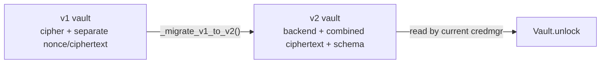
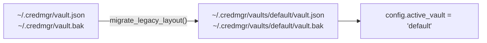

# Migration

`credmgr` distinguishes three kinds of migration, each solving a
different problem and living in a different code path. This page covers
all three.

| Kind | Trigger | Needs the master password? | Code |
|---|---|---|---|
| [Vault format version](#vault-format-version-migration) | Automatic, on read | No — pure metadata reshape | `vault._migrate()` |
| [Legacy single-vault layout](#legacy-single-vault-layout-migration) | Automatic, on startup | No — moves files, doesn't decrypt them | `vaultmgr.migrate_legacy_layout()` |
| [Crypto backend](#crypto-backend-migration) | Manual — `credmgr migrate` | Yes — re-encrypts vault contents | `vault.migrate_backend()` |

Bumping the on-disk version is a metadata reshape needing no key
material; changing the encrypting algorithm needs the master password and
a full re-encryption pass. Keeping these as separate code paths keeps
each one simple to reason about and test alone.

## Vault format version migration

`vault.json`'s `version` field lets future releases change the file
layout without breaking existing vaults. `vault.MIGRATIONS` maps
`old_version -> function(raw_dict) -> raw_dict`; `_migrate()` walks a
vault forward through every applicable entry, automatically, the next
time it's read.

### v1 → v2

Pre-plugin-architecture vaults (`version: 1`) differed from the current
format in three structural ways:

| v1 | v2 |
|---|---|
| `"cipher": "aes256gcm"` (short internal name) | `"backend": "aesgcm-cryptography"` (registered plugin name) + `"algorithm"` (display label) |
| `{"nonce": "...", "ciphertext": "..."}` (separate fields) | `{"ciphertext": "..."}` (nonce concatenated into one blob) |
| No `"schema"` field (only ever credentials) | `"schema": "credentials"` explicit |



This is a **pure structural transform** — concatenating existing bytes
and mapping an old cipher name to a backend name. It needs no decryption
and can't fail authentication, so it's safe to run unconditionally on
every read of an old vault.

## Legacy single-vault layout migration

Installs from before multi-vault support (`credmgr` versions that only
ever had one vault at `~/.credmgr/vault.json`) are upgraded to the
multi-vault directory layout automatically, once, the first time
`credmgr` runs after upgrading:



This runs as a no-op if `~/.credmgr/vaults/` already exists (already
migrated, or a fresh multi-vault install with nothing to migrate) and
never overwrites an existing `default` vault. See
[vault-format.md](vault-format.md#legacy-single-vault-layout) for the
before/after directory trees.

## Crypto backend migration

Unlike the two migrations above, switching which algorithm encrypts a
vault's contents is a deliberate, user-initiated operation:

```bash
credmgr migrate --backend xchacha-pynacl
```

This is covered in detail, including the exact sequence of operations
and its "no plaintext ever touches disk" guarantee, in
[crypto.md](crypto.md#migrating-between-backends).

## Moving data between schemas

There is currently no built-in converter between schemas (e.g.
`credentials` → `env`). To move data across schemas, use each schema's
`export`/`import` commands and reshape the exported data by hand, or
write a small script against the schema's documented format (see
[plugin-system.md](plugin-system.md#bundled-schemas)).

## Upgrading `credmgr` itself

A vault whose `version` is newer than the running build supports raises
a clear error asking you to upgrade:

```
Vault version 3 is newer than the version this build of credmgr supports (2). Please upgrade credmgr.
```

There is no downgrade path — always back up `vault.json`/`vault.bak`
(or use `credmgr export`) before upgrading across a major version.
