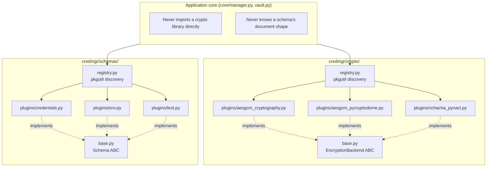

# Plugin System

`credmgr` has two independent plugin systems that share the same
discovery pattern:

- **Crypto backends** (`credmgr/crypto/plugins/`) — how a vault is
  encrypted.
- **Schemas** (`credmgr/schemas/plugins/`) — what shape a vault's
  contents take, and which commands it supports.

Neither the CLI, the application core, nor the vault storage layer
hardcodes a list of plugins. Both are discovered from the filesystem at
runtime, so adding a new backend or schema typically means adding one
new file rather than editing existing ones (the Open/Closed Principle
in practice).

## Plugin architecture



## Discovery mechanism

Both `crypto/registry.py` and `schemas/registry.py` implement the same
loop:

1. Walk the corresponding `plugins/` package with `pkgutil.iter_modules()`.
2. `importlib.import_module()` each module found.
3. For every class defined in that module, check whether it's a concrete
   subclass of the relevant interface (`EncryptionBackend` or `Schema`)
   and register it under its `.name` attribute.

Two properties make this safe:

- **Importing a plugin never crashes discovery.** The import is wrapped
  in a bare `try/except Exception: continue` — a plugin with a missing
  dependency, a syntax error, or any other import-time failure is simply
  skipped. One broken plugin can't take down the whole application.
- **Registered-but-unavailable is distinguishable from unregistered**
  (crypto only). `all_backends()` lists every plugin found on disk;
  `available_backends()` filters to those whose `is_available()` is
  currently `True`. This lets `credmgr init`'s menu only offer usable
  backends, while `get_backend()` can still tell you exactly which
  `pip install` fixes an unavailable one.

Discovery runs once per process (`_discovered` flag) and is cached for
the rest of the invocation.

## The crypto backend interface

```python
class EncryptionBackend(ABC):
    name: str          # stable identifier stored in vault metadata, e.g. "aesgcm-cryptography"
    algorithm: str     # human-readable label, e.g. "AES-256-GCM"
    key_size: int
    nonce_size: int
    pip_extra: str     # pyproject.toml extra that installs this backend's dependency

    def is_available(cls) -> bool: ...
    def generate_key(cls) -> bytes: ...
    def encrypt(key, plaintext, aad=None) -> bytes: ...   # returns one opaque blob (nonce+ciphertext)
    def decrypt(key, ciphertext, aad=None) -> bytes: ...  # consumes that same blob
```

Callers never handle the nonce separately — one less thing for `vault.py`
to get wrong. Every third-party library import happens *inside*
`is_available()`/`encrypt()`/`decrypt()`, never at module scope, so a
missing dependency degrades to `is_available() → False` instead of an
import-time crash.

### Writing a custom crypto plugin

A new backend needs one new file in `credmgr/crypto/plugins/`; the
checklist below covers the other small, one-time steps (registering the
pip extra, adding a contract test).

```python
# credmgr/crypto/plugins/my_backend.py
from __future__ import annotations
import os
from ..base import EncryptionBackend
from ..exceptions import BackendUnavailableError, DecryptionError, EncryptionError

class MyBackend(EncryptionBackend):
    name = "my-backend"          # stable ID; never rename once a vault uses it
    algorithm = "My-Algorithm"
    key_size = 32
    nonce_size = 12
    pip_extra = "my-backend"     # must match an extra in pyproject.toml

    @classmethod
    def is_available(cls) -> bool:
        try:
            import my_crypto_library  # noqa: F401 -- lazy import, never at module scope
        except ImportError:
            return False
        return True

    @classmethod
    def generate_key(cls) -> bytes:
        return os.urandom(cls.key_size)

    @staticmethod
    def encrypt(key: bytes, plaintext: bytes, aad: bytes | None = None) -> bytes:
        try:
            import my_crypto_library as lib
        except ImportError as e:
            raise BackendUnavailableError("...pip install credmgr[my-backend]...") from e
        nonce = os.urandom(MyBackend.nonce_size)
        try:
            ciphertext = lib.encrypt(key, nonce, plaintext, aad)
        except Exception as e:
            raise EncryptionError(str(e)) from e
        return nonce + ciphertext  # blob layout is up to you

    @staticmethod
    def decrypt(key: bytes, ciphertext: bytes, aad: bytes | None = None) -> bytes:
        try:
            import my_crypto_library as lib
        except ImportError as e:
            raise BackendUnavailableError("...pip install credmgr[my-backend]...") from e
        nonce, actual_ct = ciphertext[:MyBackend.nonce_size], ciphertext[MyBackend.nonce_size:]
        try:
            return lib.decrypt(key, nonce, actual_ct, aad)
        except Exception as e:
            raise DecryptionError("Decryption failed (authentication error).") from e
```

Checklist:

- [ ] `name` is unique and, once released, never changes (existing vaults
      reference it verbatim).
- [ ] All library imports are inside methods, never at module scope.
- [ ] `encrypt`/`decrypt` translate library-specific exceptions into
      `EncryptionError`/`DecryptionError`.
- [ ] Add the extra to `pyproject.toml`'s `[project.optional-dependencies]`.
- [ ] Add a test module mirroring `tests/test_backend_contract.py` (picked
      up automatically via `available_backends()`).

No changes needed to `registry.py`, `vault.py`, `core/manager.py`,
`cli/commands.py`, or `config.py` — `pkgutil`-based discovery finds the
new file on next run.

## The schema interface

```python
class Schema(ABC):
    name: str

    def new_document(cls) -> Any: ...    # fresh, empty document for a brand-new vault
    def parse(cls, plaintext: bytes) -> Any: ...      # decrypted bytes -> in-memory document
    def serialize(cls, document: Any) -> bytes: ...   # in-memory document -> plaintext bytes

    # CRUD, dispatched generically by core/manager.py. Each has a
    # default that raises SchemaError; override only what your schema
    # supports. None of these may print or read from the terminal --
    # they return a CommandResult (see architecture.md) instead.
    def cmd_list(self, document, args, config) -> CommandResult: ...
    def cmd_list_all(self, document, config) -> CommandResult: ...
    def cmd_get(self, document, args, config) -> CommandResult: ...
    def cmd_add(self, document, args, opts, config) -> CommandResult: ...
    def cmd_update(self, document, args, opts, config) -> CommandResult: ...
    def cmd_delete(self, document, args, config, confirmed=False) -> CommandResult: ...
    def cmd_search(self, document, query, config) -> CommandResult: ...
    def cmd_copy(self, document, args, config) -> CommandResult: ...
    def cmd_history(self, document, args, config) -> CommandResult: ...
    def cmd_audit(self, document, config) -> CommandResult: ...
    def cmd_import(self, document, filepath, config) -> CommandResult: ...
    def cmd_export(self, document, config) -> CommandResult: ...

    # Cross-vault search index for `credmgr global` (see globalindex.py).
    # Default raises SchemaError, same as the cmd_* methods -- a schema
    # that doesn't implement this just doesn't participate in `global`.
    def index_entries(self, document) -> list[IndexEntry]: ...
```

`core/manager.py`'s `CredentialManager` collects raw CLI arguments and
shared option flags (`generate`, `passphrase`, `length`, `words`,
`notes`) and hands them, unopinionated, to whichever `cmd_*` method the
invoked command maps to. It persists the vault whenever the returned
`CommandResult.mutated` is `True`. A schema that doesn't support an
operation simply doesn't override it — the default raises `SchemaError`,
which the CLI frontend reports as a clean error message instead of a
traceback. A schema that needs a secret value it wasn't given (e.g. a
new password, when the caller didn't ask to generate one and didn't
supply one) raises `SecretRequired`, which a frontend catches the same
way it catches `PasswordRequired` -- see architecture.md's
"Frontend/core split".

`cmd_list_all` is the one method not called once per invocation: the
`credmgr list-all` command authenticates against *every* vault on disk
(see `vaultmgr.list_vault_names`) and calls `cmd_list_all(document,
config)` once per vault, against whichever schema that vault happens to
use, printing a header line between vaults. Everything else operates on
the single active vault.

### `index_entries` and the `global` command

`credmgr global <query>` (see [cli-reference.md](cli-reference.md)) is
schema-agnostic in the same way: it never branches on which schema a
vault uses. What makes that possible is `index_entries`, and one small
data class, both in `schemas/base.py`:

```python
@dataclass
class IndexEntry:
    fields: dict[str, str]        # matched case-insensitively/partially by `global`
    summary: list[tuple[str, str]]  # ordered (label, value) shown once a search narrows to this entry
    args: list[str]               # resolves this entry via this schema's own cmd_get, post-unlock
```

`index_entries(self, document) -> list[IndexEntry]` returns one
`IndexEntry` per searchable item in a document. `credmgr/globalindex.py`
calls it right after any command saves a vault, and stores the result
(vault name, schema name, and the raw `fields`/`summary`/`args`) in
`~/.credmgr/index.json` — plaintext, but containing only identifiers,
never secrets. `credentials` indexes one entry per `(service, userid)`
pair; `env` indexes one entry per key. Neither schema needs to know
`global` exists beyond implementing this one method — `globalindex.py`
and the `global` command never import or special-case either
plugin.

Once a search narrows down to one entry and the user picks it,
`CredentialManager.get_from_vault()` unlocks *only* that entry's vault
and calls `schema.cmd_get(document, entry.args, config)` — the same
`cmd_get` every schema already implements for the plain `get` command.
That's the whole "resolve a selected entry after unlock" step: no new
dispatch path, no schema-specific branching in `global` itself.

A schema that doesn't override `index_entries` (the default raises
`SchemaError`) simply never contributes entries to the index — its
vaults are silently skipped by `global`, not crashed on.

### Bundled schemas

| Schema | Document | Supports |
|---|---|---|
| `credentials` (default) | `Credentials` — a `service → [Account, ...]` tree, each `Account` carrying userid/password/notes/history | All commands, including `audit` and `history`; indexed for `global` by `(service, userid)` |
| `env` | `EnvDocument` — an ordered list of `(key, value)` pairs | `list`, `list-all`, `get`, `search`, `copy`, `add`, `update`, `delete`, `import`, `export` (no `audit`/`history`); indexed for `global` by `key` |
| `text` | `TextDocument` — one undivided string, the vault's entire decrypted content | `list`, `get`, `search`, `copy`, `add`, `update`, `delete`, `import`, `export` (no `list-all`/`audit`/`history`, and not indexed for `global` — there are no identifiers to index) |

`list-all` prints a bare, unfiltered per-vault listing shaped by the
schema: every service with every userid under it (`credentials`), or
every key (`env`) — no counts, no truncation, just the identifiers.
The `text` schema doesn't implement `list-all` (or `global` indexing)
at all, since it has no keyed entries to list.

The `env` schema's on-disk plaintext (before encryption) is a flat
`KEY=VALUE`-per-line text file — blank lines and `#`-prefixed lines are
ignored on parse, order is preserved, and values are stored exactly as
given.

The `text` schema's on-disk plaintext (before encryption) is exactly
whatever the vault's content is — no framing, no per-entry structure.
`add` appends a new line, `update` replaces the whole document, `get`/
`copy`/`delete` optionally take a 1-indexed line number or `start-end`
range to address a specific line, and `import` appends a file's
contents onto whatever is already stored. It's the schema to reach for
when a vault should just *be* an encrypted text file — a note, a
private key, an arbitrary secret blob — rather than a structured store.

### Writing a custom schema

Create a module under `credmgr/schemas/plugins/` with a class
implementing `Schema` and a unique `.name`; it's discovered automatically
the same way crypto plugins are. Nothing in `vault.py` or
`core/manager.py` needs to change. When creating a new vault for
your schema:

```bash
credmgr vault create <name> --schema <your-schema-name>
```

## Choosing a schema at vault-creation time

```bash
credmgr vault create work --schema credentials    # service logins
credmgr vault create employee --schema env         # flat KEY=VALUE store
credmgr vault create notes --schema text           # one encrypted text blob
credmgr vault list                                  # shows each vault's active schema
```

The chosen schema is fixed for the life of that vault; move data between
schemas by exporting from one and writing an importer for the other (no
built-in cross-schema converter exists today).
