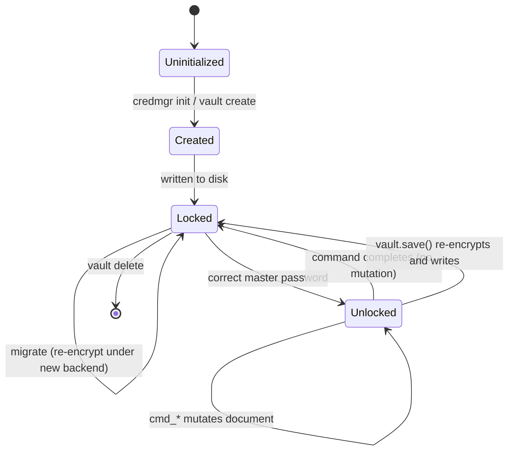

# Vault Format

This document describes the on-disk layout of a `credmgr` vault, the
multi-vault directory structure, and how the vault lifecycle works.
For the encryption applied to the fields below, see [crypto.md](crypto.md).

## Directory layout

Every vault is a self-contained directory:

```
~/.credmgr/
├── config.json                # persisted configuration overrides
├── data/                       # optional security datasets (see README)
│   ├── wordlist.txt
│   ├── common_passwords.txt
│   ├── sequences.txt
│   └── breached_hash.txt
└── vaults/
    ├── default/
    │   ├── vault.json           # current vault contents
    │   ├── vault.bak             # previous version, for crash recovery
    │   └── vault.tmp               # transient file during atomic writes
    ├── work/
    │   └── vault.json
    └── employee/
        └── vault.json
```

Each named vault (`default`, `work`, `employee`, …) is created with
`credmgr vault create <name>`, has its own master password, its own
encryption backend, and its own schema. `~/.credmgr/vaults/` is `0700`;
each `vault.json` is `0600`. See the [CLI reference](cli-reference.md) for
the full `credmgr vault ...` command group.

The `config.active_vault` field decides which vault generic commands
(`add`, `get`, `search`, …) operate on when no vault is explicitly named;
switch it with `credmgr vault use <name>`.

## vault.json structure

```json
{
    "version": 1,
    "schema": "credentials",
    "kdf": {
        "algorithm": "argon2id",
        "time_cost": 3,
        "memory_cost": 65536,
        "parallelism": 2,
        "hash_len": 32,
        "salt": "<base64>"
    },
    "backend": "xchacha-pynacl",
    "algorithm": "XChaCha20-Poly1305",
    "encrypted_key": { "ciphertext": "<base64>" },
    "vault": { "ciphertext": "<base64>" }
}
```

| Field | Meaning |
|---|---|
| `version` | Vault file format version (see [migration.md](migration.md)). Currently `1` (Vault Format v1). |
| `schema` | Name of the registered `Schema` plugin that owns the shape of the decrypted `vault` contents (e.g. `credentials`, `env`). Stored in plaintext — needed to route CRUD commands *before* the vault can be decrypted. |
| `kdf` | Argon2id parameters and random salt used to derive the KEK from the master password. Fixed for the life of a vault. |
| `backend` | Name of the registered crypto plugin that encrypted `encrypted_key` and `vault`. Looked up through the crypto registry on every unlock — this module never hardcodes an algorithm. |
| `algorithm` | Human-readable label for `backend` (e.g. `"XChaCha20-Poly1305"`), purely informational — never used to select the plugin. |
| `encrypted_key` | The random Data-Encryption Key (DEK), wrapped under the KEK. `ciphertext` is one base64 blob (nonce + ciphertext concatenated, backend-defined layout). |
| `vault` | The entire schema document, serialized by the schema and encrypted under the DEK. Same `{ "ciphertext": ... }` shape. |

Both `encrypted_key` and `vault` are AEAD-encrypted with a fixed,
domain-separating associated-data string (`"credmgr-dek"` and
`"credmgr-vault"` respectively), so a wrapped-DEK ciphertext can never be
replayed as vault ciphertext. See [crypto.md](crypto.md) for details.

## Vault lifecycle



In practice, "Unlocked" is transient: it exists only in memory for the
duration of a single CLI invocation (or, with session caching enabled,
until the cached DEK expires). The vault file on disk is always in the
"Locked" (encrypted) state between commands.

## Crash-safe writes

Every write to `vault.json` follows the same procedure, in `vault.py`'s
`_write_raw()`:

1. Write the new contents to `vault.tmp`.
2. `fsync` the file descriptor.
3. Copy the *previous* `vault.json` to `vault.bak`.
4. Atomically replace `vault.json` with `vault.tmp`.

If `vault.json` is corrupted or unreadable on the next read (e.g. the
process was killed mid-write on step 4), `credmgr` automatically falls
back to `vault.bak` and restores it as the primary file. Vault directories
are created with `0700` permissions and vault files with `0600`.
